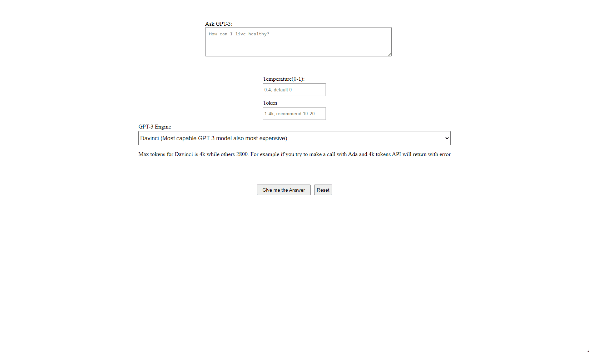

### Project Overview
---
 Basic UI for testing OpenAI GPT-3 Engines

 

---
### Technologies
-  JavaScript 
-  Node.js 

-  OpenAI

---
### Libraries
- [Axios]
- [Express]
- [cors]
- [dotenv]

---
# How To Use

First;
1. In terminal type npm install from both client and server folders to install neccessary packages.
2. Create an account from [OpenAI] to receive your API Key

### Client
For initializing client I prefer http-server, you can initialize however you want. For initialize with http-server instructions are below, if it's not useful for you skip to "Server";

1. Install http-server globally by npm install -g http-server --save
2. Go to client folder and type "http-server --cors" from terminal it will create a http-server at localhost:8080 by default

### Server

1. Go to server folder and type "node index.js"
2. Create .env folder inside server and add your PORT & API KEY.

    Example: 

    PORT="Desired Port for Server || 8088"

    OPENAI_API_KEY="Your API Key"

[Axios]: https://www.npmjs.com/package/axios
[Express]: https://expressjs.com/
[cors]: https://www.npmjs.com/package/cors
[dotenv]: https://www.npmjs.com/package/dotenv
[OpenAI]: https://openai.com/